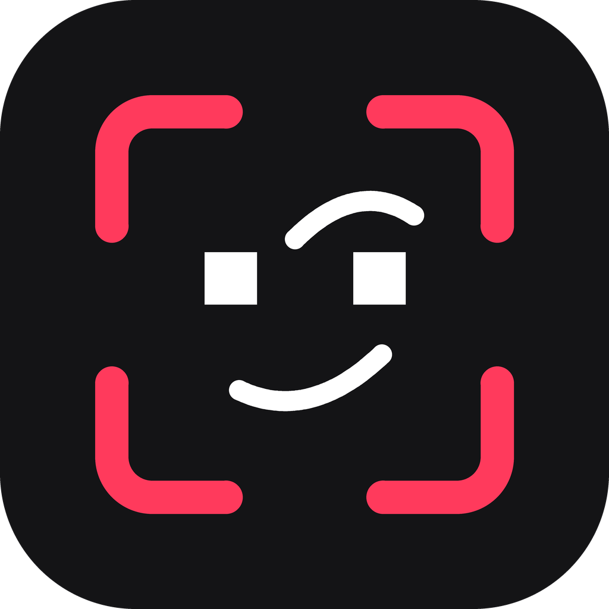

# Smugshot

A pointing tool for working with AI agents. It's "screenshot" crossed with "mugshot", taken by someone who already knows they're right.

Press a hotkey, drag over part of your screen, paste a path into a chat with an agent that can read your disk. The agent gets the whole screen with your part outlined, a sharp close-up, and a small text file that says what it is looking at. There is no editor and no annotation step. The drag is the whole gesture.

Mac (macOS 15 or later) is the full version. There is a first Windows version with the gesture only; see the end.

**Download:** https://smugshot.io, free. Or read the code here and build it yourself; see "Check it yourself" at the end.

## Use it

1. Press **Command + Shift + 1** (changeable in Settings). The screen freezes and dims slightly, like the Mac's own Command + Shift + 4, so a hover state or a tooltip you had showing stays visible while you drag.
2. Drag over the thing you want to show.
3. You hear a short sound (choose which in Settings). Paste into the chat. It looks like this:

   ```
   smugshot: /Users/you/.smugshots/2026-09-17-202006/shot.md
   ```

To cancel: Esc, a right-click, a click without dragging, or the hotkey again.

The menu bar menu has **Copy last smugshot again** for one more question about the same thing, **Recent smugshots** with the last five (a thumbnail and the app; hold Option to show one in Finder instead), and **Quiet** for calls and screen shares: no sound, no icon flash.

The word in front of the path is there on purpose. A message that starts with `/` is read as a command by Claude Code and other chat tools.

## What a smugshot is

```
~/.smugshots/2026-09-17-202006/
  shot.md     the path on your clipboard; explains itself to any agent
  full.png    whole screen, your part outlined, the rest dimmed
  crop.png    your part at full sharpness, with some margin
```

`shot.md` tells the agent, in this order of trust:

- **Web element** (Brave, Chrome, Edge, Arc, Vivaldi, Safari): the HTML of the page element you dragged over, a selector, `data-testid`, and on React dev sites the component names. This is what you would otherwise copy by hand with right-click, Inspect.
- **What was there**: the actual control under the drag (role, label, state, and for web pages the DOM id and classes), its parents up to the window, and what else sits inside the dragged area. It comes from the Mac's accessibility layer, the one screen readers use, so it works in any well-built app.
- **Text read from the close-up**: recognised on your Mac from the picture. It is there even in apps that publish nothing, like games and canvas apps.
- The app, the window title and, in a browser, the page address.

Two pictures because agents shrink big images before the model sees them (Claude Code to 2000 pixels on the long side). On a Retina screen that blurs small text, so the close-up is kept sharp and both pictures are capped at 2000 pixels.

Each smugshot deletes itself after a day unless you change that in Settings. The folder is readable only by you, skipped by Spotlight, excluded from Time Machine, and outside anything iCloud syncs.

**Know this:** a smugshot pictures the whole screen. Whatever else is visible (a password manager, tokens in a terminal, another chat) goes to the model provider along with the part you pointed at.

## Install from source

You need Xcode's command line tools (Swift 6). Nothing else; the app has no dependencies.

```bash
./scripts/make-cert.sh        # once: a self-signed signing certificate (asks for your Mac password)
./scripts/build.sh --install  # builds, signs, copies to /Applications, starts it
```

Then give it its permissions. All three are asked for once and survive rebuilds:

| Permission | Where | What stops working without it |
|---|---|---|
| Screen Recording | System Settings > Privacy & Security > Screen & System Audio Recording. Restart Smugshot once after switching it on. | Everything. |
| Accessibility | System Settings > Privacy & Security > Accessibility | "What was there" says it has no permission. Pictures and text still work. |
| Control your browser | macOS asks the first time you drag over a browser. Also switch on **Allow JavaScript from Apple Events** in the browser (Brave, Chrome, Arc: View > Developer; Edge, Vivaldi: Tools > Developer; Safari: Settings > Developer). | "Web element" says what to switch on. Everything else still works. |

Teach Claude Code to read a smugshot without being told how:

```bash
./scripts/install-claude-skill.sh   # installs the skill, and lets Claude Code read ~/.smugshots without asking
```

Why the certificate: without a stable signature, macOS sees every rebuild as a new app and forgets the permission. With it, rebuilds keep working.

## Settings

**Settings…** in the menu bar menu (or ⌘,) opens a small window. Every change applies at once.

| Setting | What it does | Default |
|---|---|---|
| Shortcut | Click the button, press the new keys. It needs Command, Control or Option, so it can be taken from every app. If another app already has it, the menu says so. | ⇧⌘1 |
| Save to | The folder smugshots are written to, each in its own timestamped folder. Smugshot only ever deletes folders named like a smugshot, so a folder that holds other things is safe. The Claude Code skill was allowed to read `~/.smugshots` only; with another folder Claude Code asks before reading each smugshot. | `~/.smugshots` |
| Keep for | How long a smugshot stays on disk, counted from when it was taken: 1 minute, 2, 5, 10, 30 minutes, 1 hour, 1 day, 1 week, or Forever. Agents read the files within seconds of the paste, so a few minutes is plenty. | 1 day |
| Clipboard text | The text in front of the path, spaces included. It is there because a message that starts with `/` is read as a command by Claude Code and other chat tools. Empty is allowed. | `smugshot: ` |
| Sound | The sound after a smugshot: Screen Capture, Shutter, Frog, Pop, Sent or Tink. Picking one plays it. All of them ship with macOS. | Screen Capture |
| Quiet | No sound and no icon flash after a smugshot. Also in the menu. | off |
| Gather | Three switches for what goes into shot.md besides the pictures, the app and the window: **What was there** (needs Accessibility; with it off, Smugshot stops asking for that permission), **Text read from the close-up**, and **Web element** (the browser asks once). Switching a slow one off makes a smugshot land faster. | all on |

The same settings from the command line, with no restart needed:

```bash
defaults write com.pjalle.smugshot folder -string "$HOME/Desktop/shots"
defaults write com.pjalle.smugshot keepFor -string 5m           # 1m, 2m, 5m, 10m, 30m, 1h, 1d, 1w, forever
defaults write com.pjalle.smugshot prefix -string "look: "
defaults write com.pjalle.smugshot readText -bool false         # also nameControls, webElement
defaults write com.pjalle.smugshot quiet -bool true
defaults write com.pjalle.smugshot sound -string pop            # screen-capture, shutter, frog, pop, sent, tink
defaults write com.pjalle.smugshot hotkeyKeyCode -int 18        # 18 is the "1" key
defaults write com.pjalle.smugshot hotkeyModifiers -int 768     # 256 Command + 512 Shift (2048 Option, 4096 Control)
defaults delete com.pjalle.smugshot folder                      # back to the default
```

## Working on it

- `Sources/Smugshot/`: `HotKey` (system hotkey), `Capturer` (the picture), `Overlay` (the drag layer), `Renderer` (full.png and crop.png), `Accessibility` (what was there), `TextReader` (text from the close-up), `Browser` (the web element), `Store` (the folder, cleanup, shot.md), `Settings` (the settings, the retention presets, the shortcut and key names), `SettingsWindow`, `AppDelegate` (the gesture and the menu), `MenuBarIcon`.
- `agents/claude-skill/`: the Claude Code skill. `design/chosen/`: the icon, drawn from geometry by `python3 scripts/draw-icon.py` (needs Pillow); `swift scripts/make-icon.swift` then rebuilds `Resources/AppIcon.icns`.
- Testing without hands on the mouse: `defaults write com.pjalle.smugshot enableTestHook -bool true`, restart, and see the comment above `installTestHook` in `AppDelegate.swift`.

## Windows

`windows/` holds a first Windows version written in Go, built from any machine with `./scripts/build-windows.sh`. Press **Ctrl + Shift + 1**, drag, paste; it writes the same three files to `%USERPROFILE%\.smugshots\` and sits in the system tray.

Its settings are a small file, `%APPDATA%\Smugshot\settings.json`, opened from **Settings…** in the tray menu: the folder, `keepFor` (the same values as on the Mac), the clipboard text, the `hotkey` (`ctrl+shift+1`, `ctrl+alt+s`, `win+shift+f9`; needs a restart), and `sound` and `banner` for the tink and the small "Copied" banner after a smugshot. Other changes apply to the next smugshot. The tray menu also has "Copy last smugshot again", the last five smugshots, and the Sound and Banner switches.

It has the gesture only: no "what was there", no text reading, no web element yet. It was first run on a real Windows machine on 2026-09-18, and the gesture works. When it starts, a banner at the bottom right says it is running and names the hotkey; starting it a second time only shows "already running".


## Check it yourself

Smugshot sees your whole screen, so you should not have to take anyone's word for what it does with it. This is the code the downloads on smugshot.io are built from.

- **It never goes online.** There is no network code in the app. Look for yourself: `grep -rnE "URLSession|URLRequest|NWConnection|CFNetwork" Sources/` and `grep -rn '"net' windows/` both find nothing.
- **No account, no telemetry, no updater.** A smugshot is three files in a folder on your own disk (`Sources/Smugshot/Store.swift`, `windows/store.go`), and the folder deletes itself after the time you set.
- **What it reads:** the screen (`Capturer.swift`), the control under your drag through the accessibility layer (`Accessibility.swift`), text from the close-up, recognised on your Mac (`TextReader.swift`), and in a browser the page element you dragged over (`Browser.swift`). Each can be switched off in Settings.
- **Point your agent at it.** The code is small: about a dozen Swift files and half a dozen Go files, with no dependencies beyond what the system and the language ship with (`Package.swift`, `windows/go.mod`).
- **Or build it yourself** instead of downloading: "Install from source" above, or `./scripts/build-windows.sh` for Windows (needs Go).

Readable source does not prove that a download was built from it. If that matters to you, build your own copy.

## Licence

The app is source-available under the [Functional Source License](LICENSE.md) (FSL-1.1-MIT): read it, build it, change it and use it, for anything except offering a competing product. Each version becomes plain MIT two years after its release.

The Claude Code skill in `agents/claude-skill/` and the shape of `shot.md` are MIT from the start (`agents/claude-skill/LICENSE`), so other tools and agents are free to read and write smugshots.

Questions, bugs, ideas: open an issue, or hello@smugshot.io.
